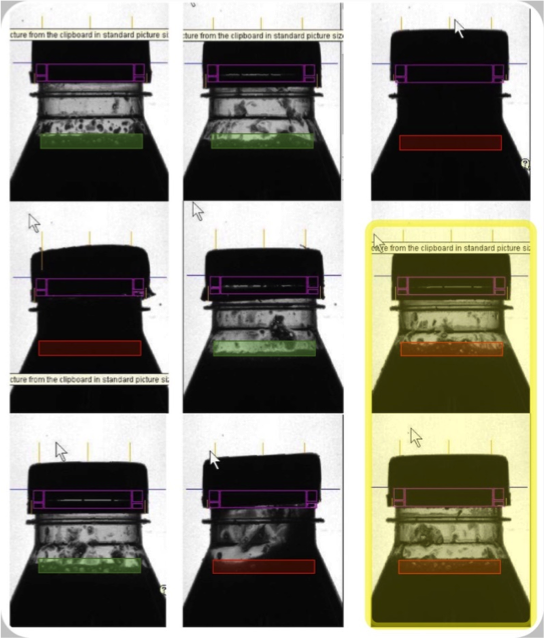
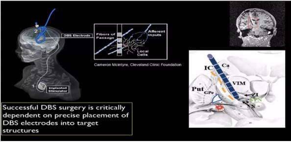
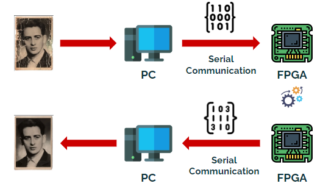

[comment]: # "This is the standard layout for the project, but you can clean this and use your own template"

# Developing image capturing and analysing system using FPGA

---

<!-- 
This is a sample image, to show how to add images to your page. To learn more options, please refer [this](https://projects.ce.pdn.ac.lk/docs/faq/how-to-add-an-image/)

 -->

## Team-23
-  E/19/423, Weerasingha W.A.C.J, [e19423@eng.pdn.ac.lk](mailto:name@email.com)
-  E/17/083, Ekanayake E.M.M.U.B, [e17083@eng,pdn.ac,lk](mailto:name@email.com)

## Table of Contents
1. [Introduction](#introduction)
2. [Image processing](#Image-processing)
3. [FPGA](#FPGA)
4. [Solution](#Solution)
5. [Technology](#Technology)
6. [Links](#links)

## Introduction

The image processing is used to extract useful information from images. This information can be used for a variety of purposes, such as object recognition,space explotation, medical diagnosis, and quality control.Due to GPUs and CPUs are general purpose processers  parallelism is limited. GPUs and CPUs typically have latency  because they have to fetch instructions and data from memory, which can add a significant delay.ASIC is not reprogramble so new a update must done with new chip implementation.So to overcome that problems FPGAs are better choice for image processing applications. They offer better performance by highly parallelism, lower latency, lower power consumption, and easier programming.So the goal of the project is implement a simple image processing system in a FPGA.

## Image processing

Image processing used to extract useful information from images.This information can be used for a variety of purposes:
				
    				object recorgnizing
				Medical imaging
				Quality control
				Space exploration
  				Multimedia
				Image restoration
				Image enchance
				Noice cancelling
				Scientafic images

 
Quality control

Medical imaging

## Some of the most common image processing applications include:

Computer vision: 
This is the field of artificial intelligence that deals with the automatic interpretation of images. Computer vision techniques are used in a wide variety of applications, such as self-driving cars, facial recognition, and medical image analysis.

Medical imaging: 
Image processing techniques are used to improve the quality of medical images, such as X-rays, MRI scans, and ultrasound images. This can help doctors to diagnose diseases more accurately.

Quality control: 
Image processing techniques are used to inspect products for defects. This is done by automatically scanning the images of products for any abnormalities.

Multimedia: 
Image processing techniques are used to enhance the quality of multimedia content, such as videos and images. This can be done by removing noise, sharpening the images, and adjusting the colors

## Image processing three different levels :

Low level: 
	Image processing(input and output is an image)
		
Mid level: 
	Image analysis(input is an image and the output is attributes extact from the image)

High level:
	Computer vission(making sense of recognized objects(AI))

## Image processing techniques:

Noise removal: This involves removing unwanted noise from an image, such as Gaussian noise or salt and pepper noise.
Sharpening: This involves improving the clarity of an image by increasing the contrast between adjacent pixels.
Contrast enhancement: This involves adjusting the contrast of an image to make it easier to see.
Edge detection: This involves identifying the edges in an image.
Object segmentation: This involves dividing an image into different objects.
Shape analysis: This involves extracting the shape of objects in an image.
Color manipulation: This involves changing the color of an image.
Image compression: This involves reducing the size of an image without losing too much information.
Image restoration: This involves restoring an image that has been corrupted by noise or other artifacts.

## Benefits of image processing:

It can be used to improve the quality of images, such as by removing noise or enhancing the contrast.
It can be used to extract useful information from images, such as the location of objects or the characteristics of a scene.
It can be used to automate tasks that are currently done manually, such as image classification or object detection.
It can be used to create new applications, such as virtual reality or augmented reality.

Image processing is a powerful tool that can be used to solve a wide variety of problems. As the field continues to grow, we can expect to see even more innovative applications of image processing in the future.

## FPGA-(Field Programmable Gate Array)

FPGA is an integrated circuit designed to be configured after manufacturing. The FPGA configuration is generally specified using a hardware description language (HDL).
FPGAs contain an array of programmable logic blocks, and a hierarchy of reconfigurable interconnects allowing blocks to be wired together. Logic blocks can be configured to perform complex combinational functions, or act as simple logic gates like AND and XOR. In most FPGAs, logic blocks also include memory elements, which may be simple flip-flops or more complete blocks of memory. Many FPGAs can be reprogrammed to implement different logic functions, allowing flexible reconfigurable computing as performed in computer software.

## Advantages of FPGAs over other types of integrated circuits :

Flexibility:
FPGAs can be reconfigured to implement different logic functions, making them ideal for applications that require a high degree of flexibility.

Performance:
FPGAs can be clocked at very high frequencies, making them ideal for applications that require high performance.
Power efficiency: FPGAs can be very power efficient, making them ideal for battery-powered applications.

Cost:
FPGAs can be relatively inexpensive, making them a cost-effective solution for many applications.

## Disadvantages:
Complexity: 
FPGAs can be complex to design and program, which can limit their adoption by some users.

Cost:
FPGAs can be more expensive than other types of integrated circuits, such as application-specific integrated circuits (ASICs).

Time to market:
FPGAs can take longer to bring to market than ASICs, which can be a disadvantage for some applications.

Overall, FPGAs are a powerful and versatile type of integrated circuit that can be used in a wide variety of applications. They offer a number of advantages over other types of integrated circuits, but they also have some disadvantages. The best choice of integrated circuit for a particular application will depend on the specific requirements of that application.

## Solution
To overcome the problems occur when using CPUs and GPUs to image processing as like as limited parallalism , latency, hard programming and energy consumption using a suitable FPGA to do calclulations for analysings and operations. Image converted to  matrix using python in computer and the matrix sent to the progeammed FPGA.FPGA Programme using HDL verilog.Then the matrix  manupiulation is done in the FPGA and the resault return to the computer.First goal to do law level image processing to gray images.Then improve for the colour images.

Data Flow

## Technology
Verilog, 
system verilog,
OpenCV,
numpy,
python,
Xlinux Vivado or Altera Quartus

## Links

- [Project Repository](https://github.com/cepdnaclk/{{ page.repository-name }}){:target="_blank"}
- [Project Page](https://cepdnaclk.github.io/{{ page.repository-name}}){:target="_blank"}
- [Department of Computer Engineering](http://www.ce.pdn.ac.lk/)
- [University of Peradeniya](https://eng.pdn.ac.lk/)

[//]: # (Please refer this to learn more about Markdown syntax)
[//]: # (https://github.com/adam-p/markdown-here/wiki/Markdown-Cheatsheet)
